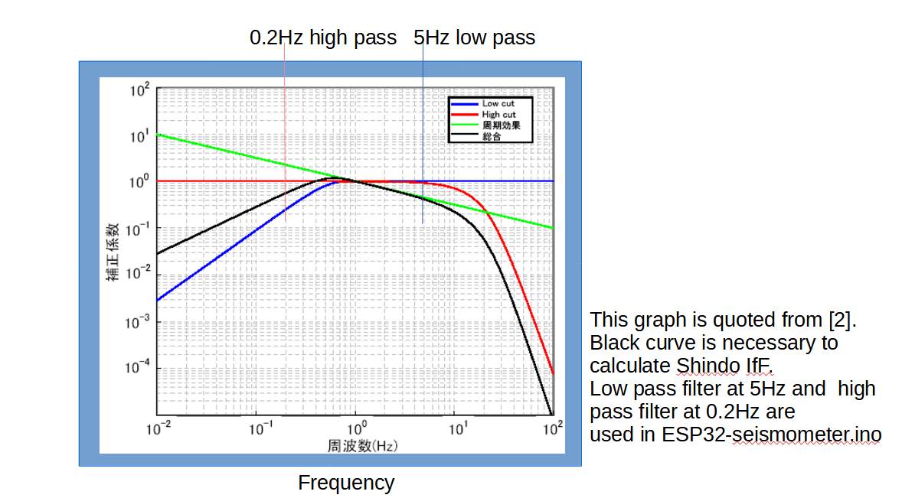
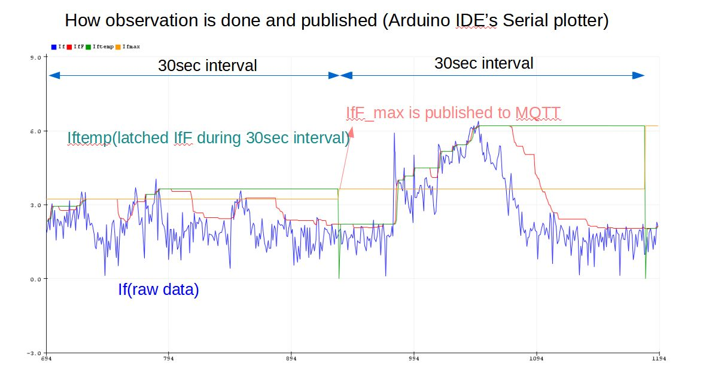
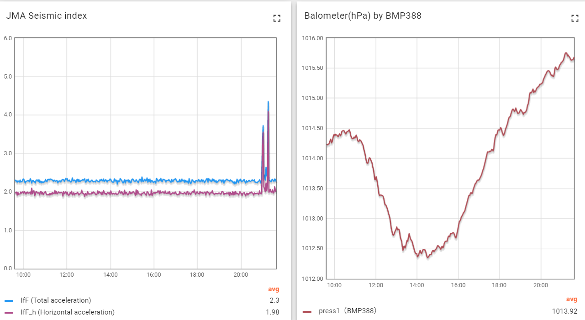
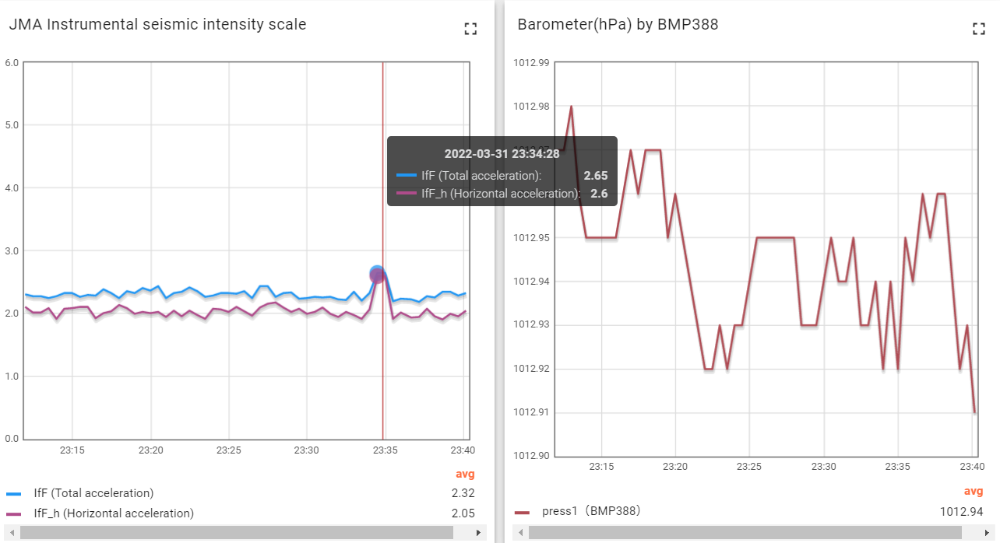
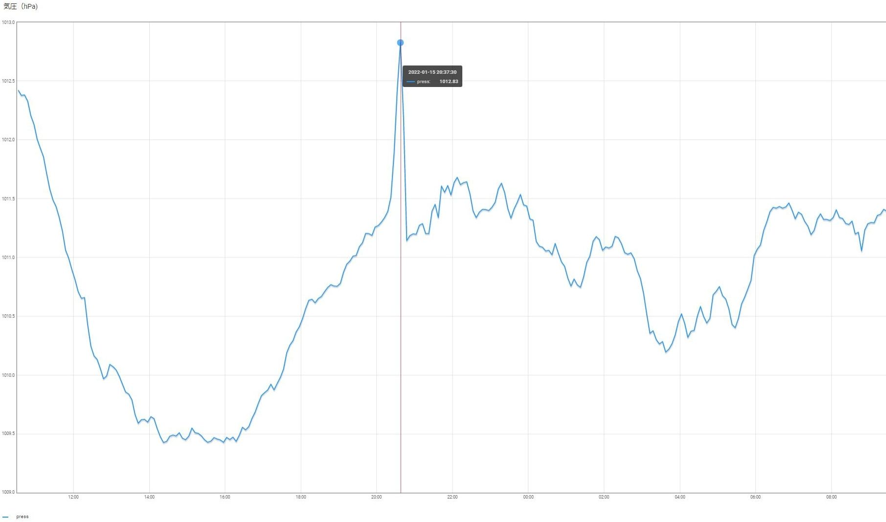

# ESP32-seismometer
Real time seismometer using MPU6050/MPU9250 
## Realtime ESP32-seismomter by MPU6050/MPU9250 with BMP388 barometer
  
This program is a personal experiment to measure realtime Japan Meteorological 
Agency(JMA)'s instrumental seismic intensity scale (Shindo) with simplified 
algorithm, not fully following the procedures defined in reference [2].

No warranty for the precision of the intensity scale provided by this program.

Shindo (JMA's instrumental seismic intensity scale ) is only used in Japan and it is different from  MSK or MM scale.[1]

## About Shindo (JMA's instrumental seismic intensity scale )

- Shindo 2.5-3.4 is around 6-20 gal.  Frequently observed in Japan. 
- Shindo 3.5-4.4 is around 20-60 gal.
- Shindo 4.5-4.9 is around 60-110 gal. Get ready to protect yourself.
- Shindo 5.0-5.4 is around 110-200 gal. I have experienced this on the 14th floor in March 11th,2011.  Extremely scary earthquake!

Shindo(Instrumental seismic intensity) and acceleration is quoted from [3].
Up to Shindo 2 is a noise level observed by this system.

## How to get Shindo (IfF)

IfF (Shindo: Instrumental seismic intensity scale by JMA ) is by definition,

         
        IfF = 2.0 * log10( af ) + 0.94 

where "af" is acceleration in gal,
after filtering in the frequency domain for the entire time span using specified filter by JMA [2].

Max "af" acceleration corresponds 0.3sec duration is used to calculate max IfF for the entire shake. [2]

For example , IfF[]={3.2 , 1.2 , 2.5 , 2.2 , 3.1} is observed every 100msec
, then let sort these values to {3.2,3.1,2.5,2.2,1.2} and the third value 2.5 is the max IfF Shindo for the earthquake.

## Realtime IfF

Procedure [2] should be done for the entire waveform of the acceleration vector
, but this program provides realtime IfF using a sliding buffer of 3 sec (30 samples) and 
simplified digital low pass/high pass filter in the time domein. 

Since the filter in frequency domain specified in [2] is not easy to implement,
software high pass filter at 0.2Hz and lowpass filter at 5Hz 
from sampling interval 10Hz are used to mimic the filter curve defined in [2].
High pass filter by Filters.h [5] also removes the gravity (980 gal), thanks to [4].

In this program , IfF at every 100msec are held for 3 sec in the sliding buffer
(30 samples) and sorted every 100msec to find the third highest value, corresponding to 0.3sec rule in [2]. (thanks to ArduinoSort[7])

Max IfF during the last 30 sec is latched and published to MQTT server as Json format data, expecting
Thingsboard running at MQTT port=2883 visualizes the Json data.( Note: default thingsboard opens port=1883 )
IfF_h is also calculated from horizontal acceleration.

    Json format : {"press1": 1023.12,"temp1": 12.5,"IfF": 2.51 , "IfF_h":2.31}

- press1: barometric pressure in hPa from BMP388
- temp1: temperature in C from BMP388
- IfF:  seismic intensity from 3D acceleration
- IfF_h: seismic intensity from horizontal acceleration

Acceleration is measured by MPU6050/MPU9250 placed horizontally.
Since earthquake or volcanic erruption may affect barometric pressure , BMP388 is attached.
Both devices are connected via I2C bus. If BMP388 is not attached , this program only
sends IfF and IfF_h.

## Simulation 
Simulation earthquake data BCJ-L1 and BCJ-L2 are available as an Exel format data from [8].
BCJ data is 10msec interval, one dimensional data , so the simulation data is given to X,Y and Z axis (half of X axis) at every 10msec.
I have converted it to float bcjL1_wave[] and bcjL2_wave[] and run the simulation by #define SIMULATION

BCJ-L1,BCJ-L2 data are not included in this repository.

| data | BCJ-L1 | BCJ-L2 | comment |
|------|------------|---------|-----------------|
|Shindo| IfF=5.5    | IfF=6.0 | See Ref.[6] page.8|
| max IfF by this program | IfF=5.44 | IfF=5.93 | for 0.2Hz software high pass filter at sampling rate 10Hz|

The simulation result is not bad by chance.

The real earth quake was observed as IFf=2.65 in 23:34 2022-3-31 JST.
According to JMA, its epicenter was Kameoka city , Kyoto pref. The magnitude was 4.3.
https://www.data.jma.go.jp/multi/quake/quake_detail.html?eventID=20220331233814&lang=en

Reported Shindo by JMA's observatory near my home  was 2 which is trancated from Shindo (Instrumental seismic intensity scale )  , corresponding to 1.5 =< IfF < 2.5. 

The observed result is not so bad.

First observation of the real earthquake 

## Hardware 
* ESP32devkit 
* GY-521 MPU6050 or MPU9250 board wired on I2C bus. 
* BMP388(optional) from Adafruit on I2C bus.
           
           SDA = GPIO_NUM_21 , SCL = GPIO_NUM_22
           LED and appropriate resister at GPIO_NUM_2 to indicate WiFi is ready

## Bluetooth Serial monitor
Bluttooth serial: acceleration(cm/s2) and IfF can be monitered by Bluetooth Serial terminal as "Seismo-BT-serial". 
Huge partition scheme in Arduino IDE is recommended when #define BTSERIAL is on.

## Development environment
Arduino board manager 1.0.6 / Arduino IDE 1.8.19

## References
  - [1] https://en.wikipedia.org/wiki/Japan_Meteorological_Agency_seismic_intensity_scale
  - [2] https://www.data.jma.go.jp/eqev/data/kyoshin/kaisetsu/calc_sindo.html
  - [3] http://www.daime.co.jp/gifujisin/data/skasokudo.html
  - [4] https://create.arduino.cc/projecthub/mircemk/sensitive-mpu6050-seismometer-with-data-logger-9e6bf5
  - [5] https://github.com/JonHub/Filters
  - [6] http://www.bousai.go.jp/jishin/syuto/denkikasaitaisaku/2/pdf/siryou3.pdf
  - [7] https://github.com/emilv/ArduinoSort
  - [8] https://www.bcj.or.jp/download/wave/
  
### Filters library
  - https://github.com/JonHub/Filters
### BMP388 library
  - https://github.com/adafruit/Adafruit_BMP3XX
### PubSubClient
  - https://github.com/knolleary/pubsubclient
### MQTT server with visiualization tools
  - https://thingsboard.io/

## License
* Copyright 2022 by coniferconifer
* Apache License

## Appendix

Barometric pressure surge by Tonga eruption in 20:39 Jan 15,2022 JST by AIRBENTO's BMP180.
The shock wave traveled 8000km from Tonga to Japan.

